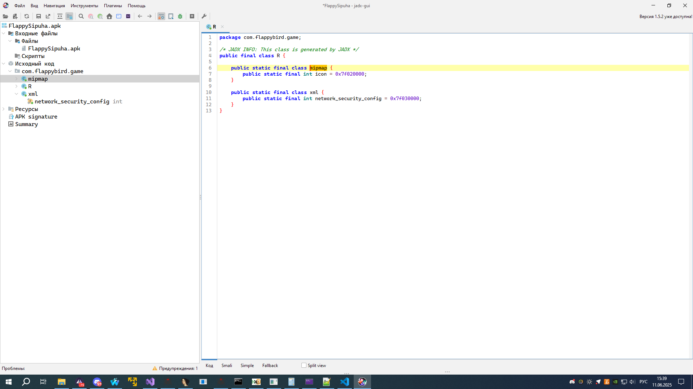
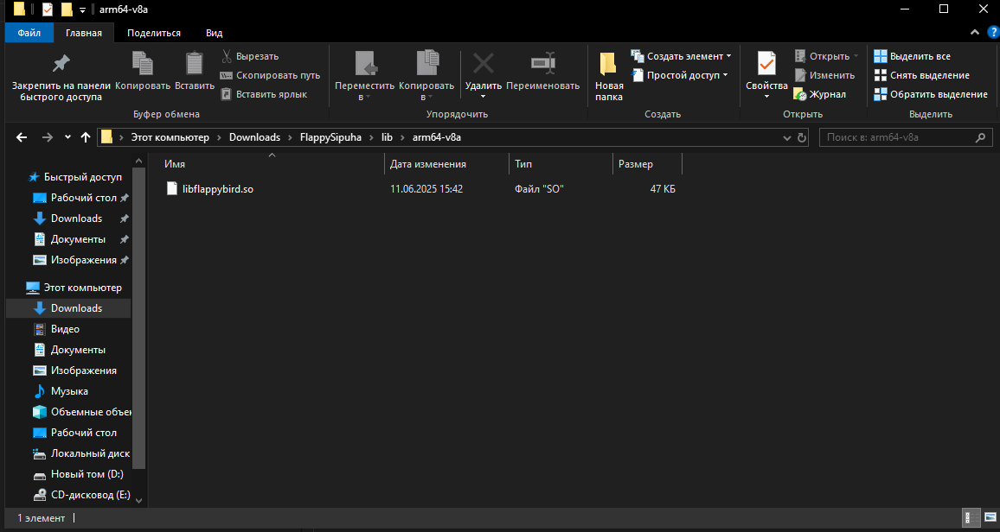
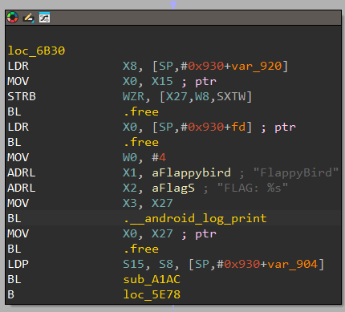
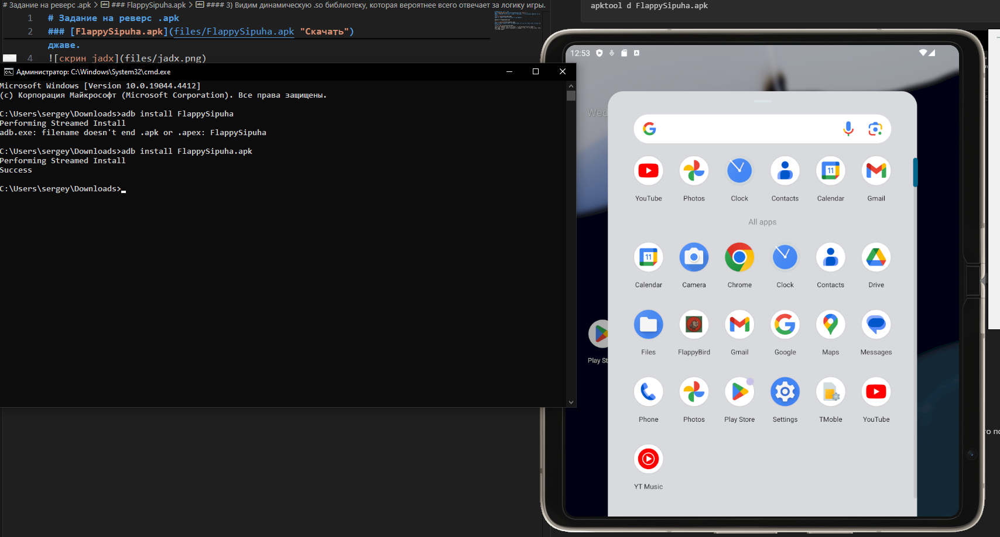
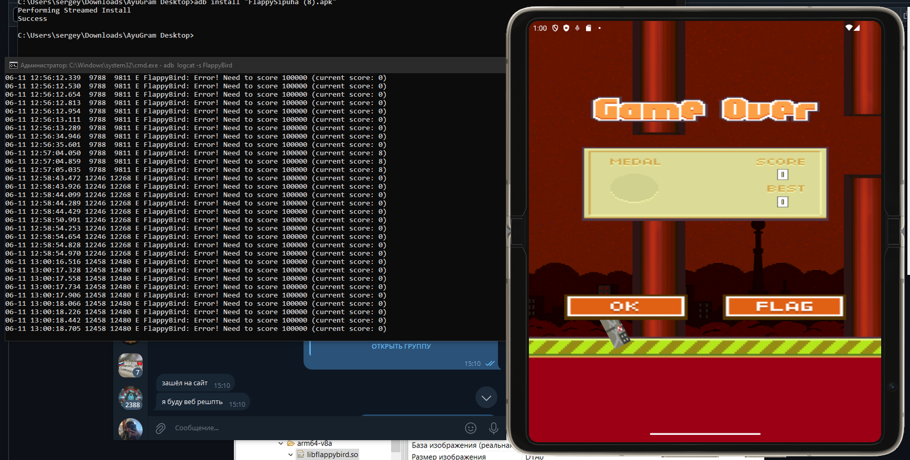
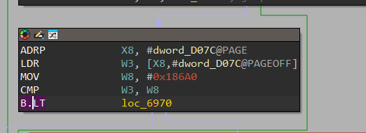
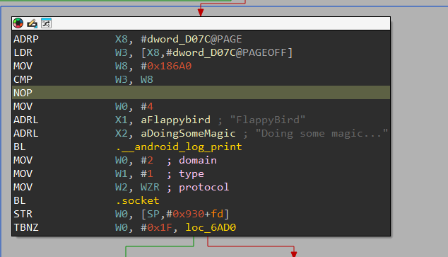
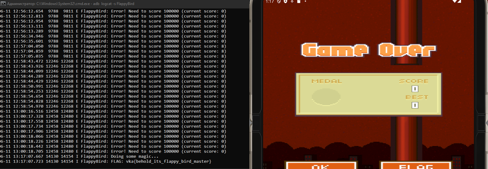

# Задание на реверс .apk
### [FlappySipuha.apk](files/FlappySipuha.apk "Скачать")
#### 1) Закинув приложение в jdax, мы понимаем, что приложение написано не на джаве.

#### 2) Распаковываем приложение через apktool.
```
apktool d FlappySipuha.apk
```

#### 3) Видим динамическую .so библиотеку, которая вероятнее всего отвечает за логику игры.
\
Немного проанализировав код мы видим, что приложение принтит какую-то информацию в логи, немного погуглив, мы узнаём о том, что эти логи можно читать через adb logcat

#### Устанавливаем на физическое устройство или эмулятор .apk
```
adb logcat -s FlappyBird
```
\
Видим логи, ищём проверку в дисассмеблере, будем патчить.
\
Нашли проверку в дисасме, заменем переход после инструции CMP на NOP
\
Сохраняем патченную библиотеку, для патчинга использовал плагин patching для ida pro
#### Билдим apk
```
apktool b
```
#### Переподписываем приложение с помощью apksigner
генерация ключа
```
keytool -genkeypair -storetype JKS -v -keystore flappysipuha.jks -keyalg RSA -keysize 2048 -validity 10000 -alias com.flappybird.game
```
подписывание .apk этим ключом
```
apksigner sign --ks flappysipuha.jks --ks-key-alias com.flappybird.game FlappySipuha.apk
```
Устанавливаем приложение, повторяем шаги выше.

#### Получаем флаг!!!
```
vka{behold_its_flappy_bird_master}
```